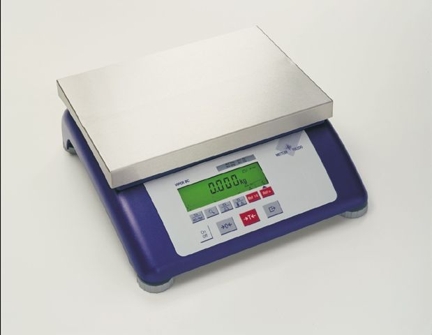

# MettlerToledoOPCUA
OPC UA Server for Mettler Toledo Scales

Many of the various Mettler Toldeo Scales only have an RS232 interface which makes reading the data difficult if you are trying to connect the data from the scales into an MES system such as [SAP ME (Manufacturing Execution)](https://www.sap.com/uk/products/execution-mes.html) or [SAP DMC (Digital Manufacturing Cloud)](https://www.sap.com/uk/products/digital-manufacturing-cloud.html). The good thing is that they all support the same basic commands detailed in this document - [Mettler Toledo Standard Interface Commands](https://www.mt.com/dam/P5/labtec/17_Miscellaneous/RM_Advanced_and_Standard_Level_Balances_SICS_EN.pdf).

This project is written in Javascript using the [Node-OPCUA](https://node-opcua.github.io/) and [SerialPort](https://serialport.io/) libraries.

NodeJS was selected due to its asynchronous nature and because it can be run on Window, Linux or Mac.

The project was developed and tested using Windows 10, NodeJS 14 and a Mettler Toledo Viper BC scale.

The plan is that this will also be tested on a Raspberry PI as this would provide a low cost method of adding OPC UA and ethernet capabilites to scales.

Install Procedure:

- Install nodejs 14, 
- Clone all the files from here into your own directory, 
- Install the dependencies using "npm install node-opcua" and "npm install serialport", 
- Execute "node mtServer ComX" where ComX is the com port where the scales are connected

The OPC UA Server exposes the following tags 

- DecodedResponse- String- Translation of the respose code from the scales into a more friendly message
- RawRespose- String- The raw data directly from the scales
- ReadStableWeight- Boolean- Writing 1 to this tag will trigger the scales to read the STABLE weight
- ReadWeightImmediate- Boolean- Writing 1 to this tag will trigger the scales to read the weight regardless if it is stable
- ReadWeightImmediateRepeat- Boolean- Stream the weight data constantly until you send another command to stop
- Reset- Boolean- Reset scales (replies with the serial number)
- SerialNumber- String- Serial number of the connected scales
- SerialPortConnected- Boolean- 1 when scales are connected (still work in progress)
- SoftwareVersion- String- Software version of the scales
- Tare- Boolean- Writing 1 to this tag will Tare the scales
- TareWeight- Float- The Tare weight 
- TareWeightUOM- String The unit of measure for the tare weight
- Weight-Float- The weight from the scales
- WeightStable- Boolean- 1 = weight is stable, 0 = dynamic weight
- WeightUOM- String- Unit of measure for the weight
- Zero- Boolean- Writing 1 to this tag will zero the scales

